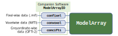

<!-- README.md is generated from README.Rmd. Please edit that file -->

```{r, include = FALSE}
knitr::opts_chunk$set(
  collapse = TRUE,
  comment = "#>",
  fig.path = "man/figures/README-",
  out.width = "100%"
)
```

# ModelArray

<!-- badges: start -->
[](https://circleci.com/gh/PennLINC/ModelArray)
[](https://codecov.io/gh/PennLINC/ModelArray)
<!-- badges: end -->

**Mass-univariate statistical modeling for large neuroimaging datasets without a supercomputer**

Brain images contain hundreds of thousands of spatial locations.
Fitting a statistical model at every single one - a fixel, a voxel, a cortical vertex - is conceptually straightforward but practically painful:
the data is too large to load into memory, and the code needed to loop efficiently across elements is tedious to write.

ModelArray handles all of this.
You write one model formula and ModelArray fits it across every element in your dataset, in parallel, reading only what it needs from disk at any moment. 
The result is a tidy data frame of statistics - one row per element - ready for thresholding and visualization.

```r
library(ModelArray)

modelarray <- ModelArray("data.h5", scalar_types = c("FDC"))
phenotypes  <- read.csv("cohort.csv")

results <- ModelArray.lm(FDC ~ Age + sex + motion, modelarray, phenotypes, "FDC",
  n_cores = 4
)
```

That's it. 
`results` is a data frame with estimates, *t*-statistics, *p*-values, and FDR-corrected *p*-values for every fixel.

## Why ModelArray?

**It scales.** ModelArray uses [HDF5](https://www.hdfgroup.org/solutions/hdf5/) for on-disk storage and [DelayedArray](https://bioconductor.org/packages/DelayedArray/) for lazy access. 
An ABCC dMRI dataset has ~350,000 voxels × ~26,000-sessions - about 291 GB if loaded in its entirety - never enters RAM.
ModelArray reads one element at a time, so memory usage stays flat regardless of dataset size.

**It's flexible.** Beyond linear models, ModelArray supports:

- **GAMs** (`ModelArray.gam()`) with penalized splines for capturing nonlinear effects, such as lifespan trajectories that accelerate or decelerate across development
- **Any R modeling function** (`ModelArray.wrap()`) — if you can write a function that takes a data frame and returns a row of statistics, ModelArray will run it across your entire dataset

**It works with what you have.** ModelArray is modality-agnostic — the same code works for fixel-wise data, voxel-wise data, and surface-based greyordinate data. The companion tool [ModelArrayIO](https://github.com/PennLINC/ModelArrayIO) handles conversion from `.mif`, NIfTI, and CIFTI formats into the HDF5 file that ModelArray expects.

**It's been peer-reviewed.** ModelArray was published in *NeuroImage* in 2023 and has been used in studies of lifespan brain development.

## Overview

<center>



</center>

## Installation

See the [Get Started](https://pennlinc.github.io/ModelArray/articles/installations.html) page for full installation instructions.

The short version:

1. Install system HDF5 libraries (`libhdf5-dev` on Linux, `brew install hdf5` on macOS)
2. Install [ModelArrayIO](https://github.com/PennLINC/ModelArrayIO) (Python, for data conversion)
3. Install ModelArray from GitHub:

```r
devtools::install_github("PennLINC/ModelArray")
```

Prefer a container? A [Docker/Singularity image](https://hub.docker.com/r/pennlinc/modelarray_confixel) with ModelArray and ModelArrayIO pre-installed is available — useful for HPC clusters where you can't install system libraries.

## Documentation

Full documentation is at [pennlinc.github.io/ModelArray](https://pennlinc.github.io/ModelArray/):

- **[Get Started](https://pennlinc.github.io/ModelArray/articles/installations.html)** — installation
- **[End-to-End Walkthrough](https://pennlinc.github.io/ModelArray/articles/walkthrough.html)** — from raw data to visualized results
- **[Introductions](https://pennlinc.github.io/ModelArray/articles/elements.html)** — what elements are, how HDF5 storage works, how to scale to large datasets
- **[Case Studies](https://pennlinc.github.io/ModelArray/articles/modelling.html)** — detailed modelling examples and data exploration recipes

## Citation

If you use ModelArray, please cite:

> Zhao, C., Tapera, T. M., Bagautdinova, J., Bourque, J., Covitz, S., Gur, R. E., Gur, R. C., Larsen, B., Mehta, K., Meisler, S. L., Murtha, K., Muschelli, J., Roalf, D. R., Sydnor, V. J., Valcarcel, A. M., Shinohara, R. T., Cieslak, M. & Satterthwaite, T. D. (2023). ModelArray: an R package for statistical analysis of fixel-wise data. *NeuroImage*, *271*, 120037. https://doi.org/10.1016/j.neuroimage.2023.120037
