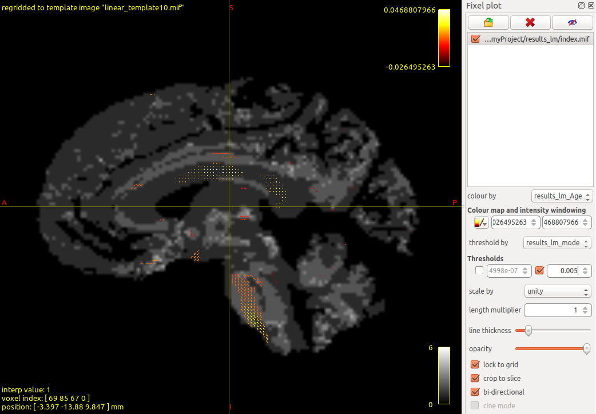

## Introduction

In this example walkthrough, we will use some example fixel data to demonstrate the steps of using ModelArray and its companion python package, `ConFixel`. By following the `vignette("a01_installations")` page, you should have successfully installed `ModelArray`, `ConFixel`, and `MRtrix`. We expect that `ConFixel` has been installed in a conda environment called "modelarray".

We will first prepare the data and convert it into the format that `ModelArray` requires (Step 1), then we'll use `ModelArray` to perform the statistical analysis (Step 2). Finally we will convert the results into original file format and view them (Step 3).

## Step 1. Prepare your data

We first create a folder called "myProject" on the Desktop. In a terminal console:

``` {.console}
$ cd ~/Desktop
$ mkdir myProject
$ cd myProject
$ pwd       # print the full path of this folder
```
On a linux machine, you'll see the printed full path of this folder is `/home/<username>/Desktop/myProject`    # TODO: ASK TINASHE: HOW ABOUT A MAC COMPUTER????
<!-- This is fine -->

Here, we provide some demo fixel data. This demo data includes 100 subjects aged 8-22 years from the Philadelphia Neurodevelopmental Cohort (PNC) [Satterthwaite et al., 2014](https://doi.org/10.1016/j.neuroimage.2013.07.064). This data was generated by following fixel-based analysis [Raffelt et al., 2017](https://doi.org/10.1016/j.neuroimage.2016.09.029) and are ready for fixel-wise statistical analysis. You can get the data by running the following:  

``` {.console}
$ wget -cO - https://osf.io/tce9d/download > download.tar.gz
$ tar -xzf download.tar.gz
$ rm download.tar.gz
```

### Step 1.1. Overview of the data organization

The data is organized in the following way: 

``` {.console}
~/Desktop/myProject
├── cohort_FDC_n100.csv
├── FDC
│   ├── directions.mifs
│   ├── index.mif
│   ├── sub-010b693.mif
│   ├── sub-0133f31.mif
│   ├── sub-063fd82.mif
│   ├── ...
└── ...

```

In this demo data, the fixel-wise metric is `FDC`. As you can see here, in folder `FDC`, besides subject-level fixel data in template space (e.g. `sub-010b693.mif`), there are also the files `index.mif` and `directions.mif`. These two files provide important information of the fixel locations - you can learn about their definitions [here](https://userdocs.mrtrix.org/en/dev/fixel_based_analysis/fixel_directory_format.html).

### Step 1.2. Prepare a CSV file of cohort phenotypes

In addition to fixel data, we also need a CSV file of cohort phenotypes. This file will be used by both ConFixel and ModelArray. Here's an example: `cohort_FDC_n100.csv`: 

| subject_id  | Age  | sex | dti64MeanRelRMS | ***scalar_name*** |     ***source_file***     |
|:-----------:|:----:|:---:|:---------------:|:-----------:|:-------------------:|
| sub-6fee490 | 8.83 |  2  |    0.863669     |     FDC     | FDC/sub-6fee490.mif |
| sub-647f86c | 8.50 |  2  |    1.775610     |     FDC     | FDC/sub-647f86c.mif |
| sub-4b3ffe0 | 8.42 |  1  |    1.911350     |     FDC     | FDC/sub-4b3ffe0.mif |
| ... | ... |  ...  |    ...     |     ...     | ... |

The table in this CSV file includes these columns:

* Required: `scalar_name`, which tells us what metric is being analyzed, and `source_file`, which tells us which mif file will be used for this subject
* Covariates: the covariates we want included in the statistical model. Here `dti64MeanRelRMS` is a measure of in-scanner motion, which we want to control for.


### Step 1.3. Convert data into a HDF5 file using ConFixel

One of the reasons why `ModelArray` is memory efficient is it takes advantages of Hierarchical Data Format 5 (HDF5) file format. The extension of this file format is `.h5`. In short, an HDF5 file stores large datasets hierarchically. Let's use `ConFixel` to convert the list of mif files into an HDF5 file. In the terminal console:

``` {.console}
$ conda activate modelarray
$ confixel \
    --index-file FDC/index.mif \
    --directions-file FDC/directions.mif \
    --cohort-file cohort_FDC_n100.csv \
    --relative-root /home/<username>/Desktop/myProject \
    --output-hdf5 demo_FDC_n100.h5
    
# remember to use your specific path in --relative-root;
# we recommend full paths too!
```

As mentioned before, here we take `~/Desktop/myProject` as the main folder; you won't need to repeat paths once you've used the `--relative-root` flag.

When running `confixel`, you will see a moving progress bar. When it finishes, it looks like this:

```console
Extracting .mif data...
100%|█████████████████████████████████████████| 100/100 [00:03<00:00, 30.33it/s]
```

Now you got the converted HDF5 file `demo_FDC_n100.h5` in folder `~/Desktop/myProject`.

## Step 2. Use ModelArray to perform statistical analysis

The next step is to use this HDF5 file and the CSV file we prepared to perform statistical analysis in R. If you installed RStudio (which we recommend), then you can simply launch RStudio. All the commands in this Step 2 section will be run in R.

### Step 2.1. Load ModelArray package in R

After you've installed `ModelArray`, here's how we load the library:

```{r load ModelArray}
library(ModelArray)
```

### Step 2.2. Create a ModelArray-class object

To create a ModelArray-class object that represents the HDF5 file of fixel data, we need the HDF5 filename and the scalar's name:

```{r create ModelArray object, eval=FALSE}
# filename of example fixel data (.h5 file):
h5_path <- "~/Desktop/myProject/demo_FDC_n100.h5"
# create a ModelArray-class object:
modelarray <- ModelArray(h5_path, scalar_types = c("FDC")) 
# let's check what's in it:
modelarray 
```
You'll see:
```{.console}
ModelArray located at ~/Desktop/myProject/demo_FDC_n100.h5

  Source files:     100
  Scalars:          FDC
  Analyses:    
```

This shows that there are 100 source FDC files in this `modelarray` you created.

You may take a look at what the scalar matrix looks like by using `scalars()`: 
```{r access slots, eval = FALSE}
# scalar FDC data:
scalars(modelarray)[["FDC"]]
```
You'll see:
```{.console}
<602229 x 100> matrix of class DelayedMatrix and type "double":
          FDC/sub-6fee490.mif FDC/sub-647f86c.mif ... FDC/sub-fb15b55.mif FDC/sub-063fd82.mif
     [1,]          0.24264026          0.15679701   .          0.00454893          0.16528498
     [2,]          0.04573315          0.30895054   .          0.25159708          0.33469012
     [3,]          0.18638037          0.26985332   .          0.26864439          0.26453218
     [4,]          0.13169773          0.36824343   .          0.19793315          0.27003124
     [5,]          0.22650713          0.16020685   .          0.10235775          0.41848758
      ...                   .                   .   .                   .                   .
[602225,]           0.1058939           0.1262244   .           0.2559175           0.2618564
[602226,]           0.2273949           0.8616257   .           0.4713631           0.5220432
[602227,]           0.1899130           1.2083211   .           0.2561999           0.1202894
[602228,]           0.0000000           1.3483975   .           0.0000000           0.0000000
[602229,]           0.1275258           0.5184639   .           0.2065310           0.1833882
```
Rows are fixels `(n = 602229)`, and column names are the source filenames `(n = 100)`. Each value is a specific fixel's FDC from a mif file.

### Step 2.3. Load cohort phenotypes CSV file

We then load the accompanying CSV file:

```{r load csv file, eval=FALSE}
# filename of example fixel data (.h5 file):
csv_path <- "~/Desktop/myProject/cohort_FDC_n100.csv"
# load the CSV file:
phenotypes <- read.csv(csv_path)
```

As this CSV file already provides sufficient covariates ready for analysis below, we don't need to do extra work on it. 

### Step 2.4. Perform statistical analysis
With both `modelarray` and data frame `phenotypes` set up, we can now perform the statistical analysis. At present, `ModelArray` supports linear models as well as generalized additive models (GAM) with penalized splines, which are particularly useful for studying nonlinear effects in lifespan data.  

Let's start with linear model `ModelArray.lm()`. We first need a formula defining the model. We mainly want to test how fixel FDC changes with age in adolescence, assuming it's a linear relationship. We also add sex and in-scanner motion quantification `dti64MeanRelRMS` as covariates. Intercept will be automatically added. We first try it out on first 100 fixels before we running on all fixels:

```{r example lm, eval=FALSE}
# formula:
formula.lm <- FDC ~ Age + sex + dti64MeanRelRMS
# run linear model fitting with ModelArray.lm() on the first 100 fixels:
mylm.try <- ModelArray.lm(formula.lm, modelarray, phenotypes, "FDC",
                          element.subset = 1:100)
```
You'll see:
```{.console}
subset: default 
weights: default 
na.action: default 
method: default 
model: default 
x: default 
y: default 
qr: default 
singular.ok: default 
contrasts: default 
offset: default 
Fitting element-wise linear models for FDC
initiating....
looping across elements....
  |++++++++++++++++++++++++++++++++++++++++++++++++++| 100% elapsed=06s  
```

It first printed how several options for `lm` were set, then worked on the model fitting. Let's check the first 6 rows of the results, i.e. results of the first 6 fixels:
```{r, eval=FALSE}
head(mylm.try)
```

You'll see:   

| element_id | Intercept.estimate | Age.estimate | sex.estimate | dti64MeanRelRMS.estimate | Intercept.statistic | Age.statistic | sex.statistic | dti64MeanRelRMS.statistic | Intercept.p.value | Intercept.p.value.fdr | Age.p.value | Age.p.value.fdr | sex.p.value | sex.p.value.fdr | dti64MeanRelRMS.p.value | dti64MeanRelRMS.p.value.fdr | model.adj.r.squared | model.p.value | model.p.value.fdr |
|:----------:|:------------------:|:------------:|:------------:|:------------------------:|:-------------------:|:-------------:|:-------------:|:-------------------------:|:-----------------:|:---------------------:|:-----------:|:---------------:|:-----------:|:---------------:|:-----------------------:|:---------------------------:|:-------------------:|:-------------:|:-----------------:|
|     0      |     0.1574554      |  0.0005079   |  0.0108810   |        -0.0067989        |      2.049316       |   0.1281586   |   0.4091826   |        -0.1915206         |     0.0431593     |       0.0644169       |  0.8982916  |    0.9946718    |  0.6833172  |    0.8444836    |        0.8485222        |          0.9952377          |     -0.0287295      |   0.9715544   |     0.9715544     |
|     1      |     0.2678434      |  0.0026411   |  -0.0180576  |        -0.0001476        |      2.956456       |   0.5651542   |  -0.5758993   |        -0.0035272         |     0.0039163     |       0.0081590       |  0.5732873  |    0.9946718    |  0.5660309  |    0.8143135    |        0.9971930        |          0.9971930          |     -0.0242065      |   0.8822558   |     0.9588263     |
|     2      |     0.3808456      |  0.0000743   |  -0.0247444  |        -0.0313025        |      3.697746       |   0.0139822   |  -0.6941623   |        -0.6577973         |     0.0003622     |       0.0016322       |  0.9888732  |    0.9946718    |  0.4892568  |    0.7900378    |        0.5122426        |          0.9952377          |     -0.0196619      |   0.7793740   |     0.9519001     |
|     3      |     0.3462063      |  -0.0015211  |  -0.0165382  |        -0.0110064        |      3.870265       |  -0.3296572   |  -0.5341844   |        -0.2663025         |     0.0001982     |       0.0010433       |  0.7423772  |    0.9946718    |  0.5944489  |    0.8143135    |        0.7905774        |          0.9952377          |     -0.0260748      |   0.9220699   |     0.9588263     |
|     4      |     0.3831223      |  -0.0012686  |  -0.0498778  |        -0.0169274        |      3.608630       |  -0.2316505   |  -1.3574013   |        -0.3450802         |     0.0004912     |       0.0017543       |  0.8173026  |    0.9946718    |  0.1778363  |    0.6969094    |        0.7307890        |          0.9952377          |     -0.0085248      |   0.5418155   |     0.9519001     |
|     5      |     0.3618128      |  -0.0008015  |  -0.0274349  |        -0.0088992        |      3.207225       |  -0.1377359   |  -0.7026583   |        -0.1707341         |     0.0018214     |       0.0044425       |  0.8907376  |    0.9946718    |  0.4839691  |    0.7900378    |        0.8647922        |          0.9952377          |     -0.0250535      |   0.9006376   |     0.9588263     |

As you can see, for each fixel, by default, `ModelArray.lm()` returns:

* Several statistics for the `Intercept`, `Age`, `sex`, and motion `dti64MeanRelRMS`. These statistics include: 
  * estimation of Intercept and the coefficients or slopes of other terms
  * t-statistics
  * p-value
  * p-value after FDR correction
* Several statistics for the linear model, including:
  * adjusted R-squared
  * p-value
  * p-value after FDR correction

You may request more comprehensive statistics with the argument `full.outputs=TRUE`.

Now let's try out `ModelArray.gam()`. The example commands are as below. Compared to a linear model, [GAM is able to flexibly model nonlinear effects, such as the nonlinear developmental effects](https://en.wikipedia.org/wiki/Generalized_additive_model).
Here we use `s(Age)` to indicate that this is a nonlinear, spline smooth term;
the `k=4` in this defined smooth term restricts its maximal degrees of freedom;
and the `REML` method is a smooth parameter estimation method.

In addition to default FDR correction, we can also request Bonferroni correction. 

We still first try it out on first 100 fixels:
```{r example gam, eval=FALSE}
# formula:
formula.gam <- FDC ~ s(Age, k=4) + sex + dti64MeanRelRMS
# run GAM fitting with ModelArray.gam() on the first 100 fixels:
mygam.try <- ModelArray.gam(formula.gam, modelarray, phenotypes, "FDC",
                            element.subset = 1:100,
                            correct.p.value.smoothTerms = c("fdr", "bonferroni"),
                            correct.p.value.parametricTerms = c("fdr", "bonferroni"),
                            method="REML")
```

You'll see:
```{.console}
The formula requested: FDC ~ s(Age, k = 4) + sex + dti64MeanRelRMS 
s(Age):   k = 4;   fx = FALSE (default);   bs = tp (default)
method = REML (default: GCV.Cp) 
Fitting element-wise GAMs for FDC
initiating....
looping across elements....
  |++++++++++++++++++++++++++++++++++++++++++++++++++| 100% elapsed=14s  
```

The GAM results of the first 6 fixels:
```{r eval=FALSE}
head(mygam.try)
```

You'll see:

| element_id | s_Age.statistic | s_Age.p.value | s_Age.p.value.bonferroni | s_Age.p.value.fdr | Intercept.estimate | sex.estimate | dti64MeanRelRMS.estimate | Intercept.statistic | sex.statistic | dti64MeanRelRMS.statistic | Intercept.p.value | Intercept.p.value.bonferroni | Intercept.p.value.fdr | sex.p.value | sex.p.value.bonferroni | sex.p.value.fdr | dti64MeanRelRMS.p.value | dti64MeanRelRMS.p.value.bonferroni | dti64MeanRelRMS.p.value.fdr | model.dev.expl |
|:----------:|:---------------:|:-------------:|:------------------------:|:-----------------:|:------------------:|:------------:|:------------------------:|:-------------------:|:-------------:|:-------------------------:|:-----------------:|:----------------------------:|:---------------------:|:-----------:|:----------------------:|:---------------:|:-----------------------:|:----------------------------------:|:---------------------------:|:--------------:|
|     0      |    0.3919938    |   0.6396933   |            1             |     0.8545475     |     0.1662467      |  0.0085795   |        -0.0015008        |      3.732225       |   0.3229002   |        -0.0419848         |     0.0003225     |          0.0322463           |       0.0003839       |  0.7474771  |           1            |    0.8591691    |        0.9665985        |                 1                  |          0.9962095          |   0.0177441    |
|     1      |    0.3193919    |   0.5732950   |            1             |     0.8308623     |     0.3083310      |  -0.0180576  |        -0.0001477        |      5.843594       |  -0.5758990   |        -0.0035275         |     0.0000001     |          0.0000070           |       0.0000001       |  0.5660311  |           1            |    0.8033110    |        0.9971928        |                 1                  |          0.9971928          |   0.0068301    |
|     2      |    0.0342444    |   0.9559484   |            1             |     0.9956698     |     0.3821904      |  -0.0252837  |        -0.0300008        |      6.376270       |  -0.7091046   |        -0.6289196         |     0.0000000     |          0.0000006           |       0.0000000       |  0.4799807  |           1            |    0.7749732    |        0.5308975        |                 1                  |          0.9962095          |   0.0143341    |
|     3      |    0.1086654    |   0.7424475   |            1             |     0.9286274     |     0.3228876      |  -0.0165382  |        -0.0110065        |      6.197683       |  -0.5341825   |        -0.2663045         |     0.0000000     |          0.0000014           |       0.0000000       |  0.5944502  |           1            |    0.8033110    |        0.7905759        |                 1                  |          0.9962095          |   0.0050187    |
|     4      |    0.0536680    |   0.8173638   |            1             |     0.9504230     |     0.3636743      |  -0.0498777  |        -0.0169276        |      5.881524       |  -1.3573985   |        -0.3450840         |     0.0000001     |          0.0000059           |       0.0000001       |  0.1778372  |           1            |    0.7013344    |        0.7307862        |                 1                  |          0.9962095          |   0.0220368    |
|     5      |    0.0189684    |   0.8908133   |            1             |     0.9682754     |     0.3495258      |  -0.0274349  |        -0.0088991        |      5.319820       |  -0.7026591   |        -0.1707324         |     0.0000007     |          0.0000678           |       0.0000012       |  0.4839686  |           1            |    0.7749732    |        0.8647935        |                 1                  |          0.9962095          |   0.0060088    |

As you can see, for each fixel, here `ModelArray.gam()` returns:

* Several statistics for the smooth term `s(Age)`, including t-statistics and p-values (and those after FDR and Bonferroni correction);
* Several statistics for the parametric terms `Intercept`, `sex`, and motion `dti64MeanRelRMS`, including estimation of the coefficient (or the slope), t-statistics, and p-values (and those after FDR and Bonferroni correction);
* One statistic for the model: `dev.expl`, which is the proportion of the null deviance explained by the model.

For more options, please view pages for `ModelArray.lm()` and `ModelArray.gam()`.


### Step 2.5. A full run and saving the results

Previous examples only ran on a small subset of the fixels. Now we'll formally run across all fixels and save the results. Because running all fixels will take a substantial amount of time, here we only run the linear model. 

Notice that the command below uses the default value of `element.subset=NULL` so that all fixels will be analyzed. Also notice that, to speed up, we're requesting 4 CPU cores to run in parallel. You may adjust this number based on how many CPU cores you have on your machine. On a Linux machine with Intel(R) Xeon(R) 10th Gen CPU @ 2.81GHz and using 4 CPU cores, it takes around 2.5 hours to finish.

```{r, eval=FALSE}
# run linear model fitting with ModelArray.lm() on the all fixels:
mylm <- ModelArray.lm(formula.lm, modelarray, phenotypes, "FDC",
                      n_cores = 4)
```

We now save the results data frame into the h5 file:

```{r write results, eval=FALSE}
writeResults(h5_path, df.output = mylm, analysis_name = "results_lm")
```

Notice that the the analysis name specified in argument `analysis_name` will be used in ConFixel in the next step when converting results back to fixel mif file format. It'll also be used as the prefix of the mif files to be saved.

We can even check out the saved results in the h5 file (this is optional):

```{r load results, eval = FALSE}
# create a new ModelArray-class object:
modelarray_new <- ModelArray(filepath = h5_path, scalar_types = "FDC",
                             analysis_names = c("results_lm"))
modelarray_new
```

You'll see:
```{.console}
ModelArray located at ~/Desktop/myProject/demo_FDC_n100.h5

  Source files:     100
  Scalars:          FDC
  Analyses:         results_lm
```
The `results_lm` is shown up here.

## Step 3. Check out the result images

### Step 3.1. Convert the statistical results into mif file format using ConFixel
We now use ConFixel to convert the results into a list of mif files:

```{.console}
$ conda activate modelarray   # activate the conda environment we created
$ fixelstats_write \
  --index-file FDC/index.mif \
  --directions-file FDC/directions.mif \
  --cohort-file cohort_FDC_n100.csv \
  --relative-root /home/<username>/Desktop/myProject \
  --analysis-name results_lm \
  --input-hdf5 demo_FDC_n100.h5 \
  --output-dir results_lm
  
# remember to use your specific path in --relative-root;
# we recommend full paths too!
```

After it's done, in the main folder `myProject`, there will be a new folder called `results_lm`, and converted result mif files are in this new folder:

```{.console}
results_lm/
├── directions.mif
├── index.mif
├── results_lm_Age.1m.p.value.fdr.mif
├── results_lm_Age.1m.p.value.mif
├── results_lm_Age.estimate.mif
├── results_lm_Age.p.value.fdr.mif
├── results_lm_Age.p.value.mif
├── results_lm_Age.statistic.mif
├── results_lm_dti64MeanRelRMS.1m.p.value.fdr.mif
├── results_lm_dti64MeanRelRMS.1m.p.value.mif
├── results_lm_dti64MeanRelRMS.estimate.mif
├── results_lm_dti64MeanRelRMS.p.value.fdr.mif
├── results_lm_dti64MeanRelRMS.p.value.mif
├── results_lm_dti64MeanRelRMS.statistic.mif
├── results_lm_element_id.mif
├── results_lm_Intercept.1m.p.value.fdr.mif
├── ...
├── results_lm_model.1m.p.value.fdr.mif
├── results_lm_model.1m.p.value.mif
├── results_lm_model.adj.r.squared.mif
├── results_lm_model.p.value.fdr.mif
├── results_lm_model.p.value.mif
├── results_lm_sex.1m.p.value.fdr.mif
├── ...

0 directories, 32 files
```

Here, `1m.p.value.*` means it's the `1 - p-value` image.

### Step 3.2. View the results in MRtrix's MRView

You can launch MRView from the terminal with `mrview`:

```{.console}
# Suppose you're in myProject folder:
$ cd results_lm   # switch to results folder
$ mrview
```

Click File -> Open, select `index.mif`. Then click Tools -> Fixel plot, you'll see a side panel of "Fixel plot". Within this side panel, click button "Open fixel image" (see below, highlighted in red):


From there, select `index.mif` file again. You'll see colored `directions.mif`. Now you can choose which image to display. Click the filename next to "colour by", select `results_lm_Age.estimate.mif`; then click the button next to "threshold by", select `results_lm_model.p.value.fdr.mif`, check/tick the option of upper limit, then enter "0.005". You may change the view by clicking "View" in the upper panel. Below is an example view:


